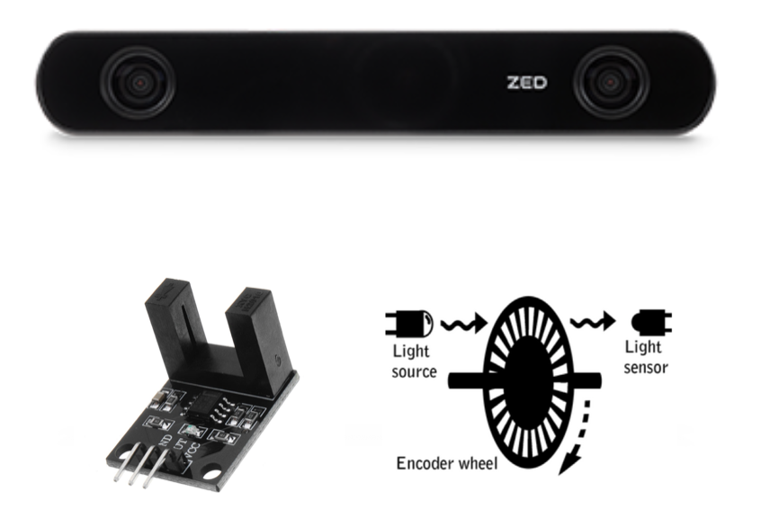
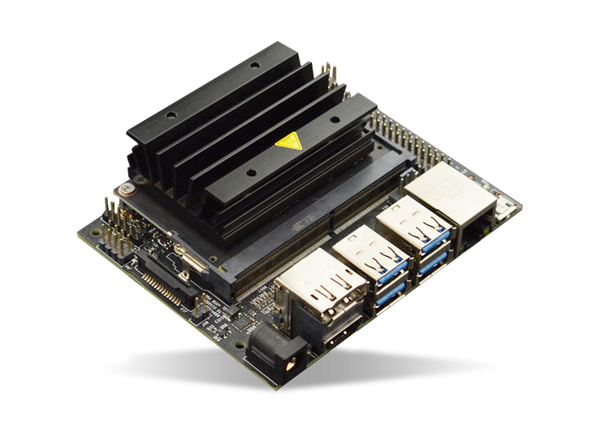
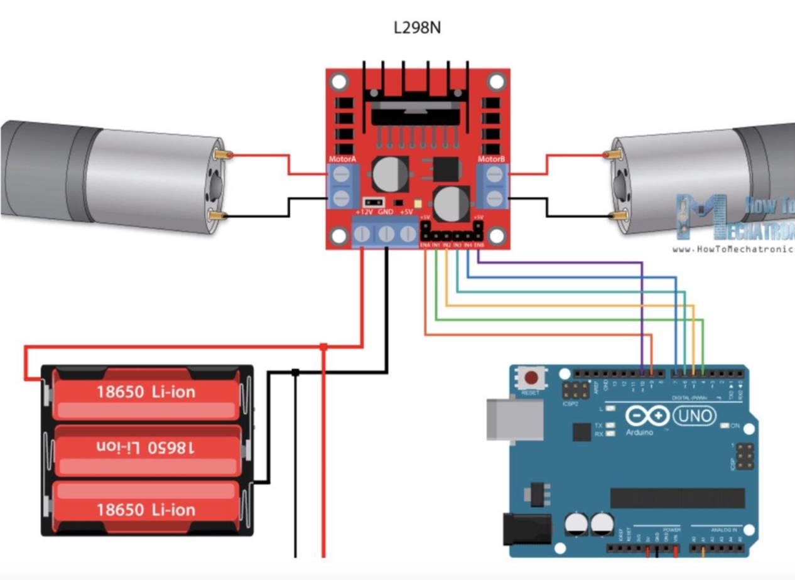
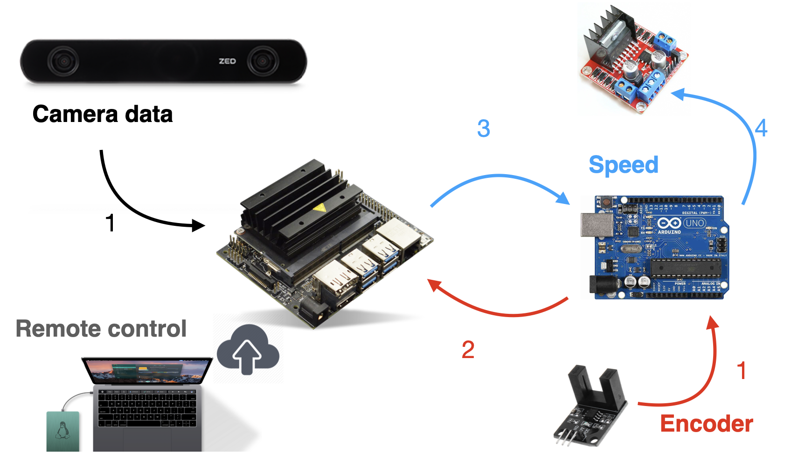
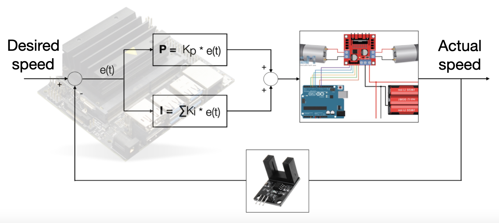
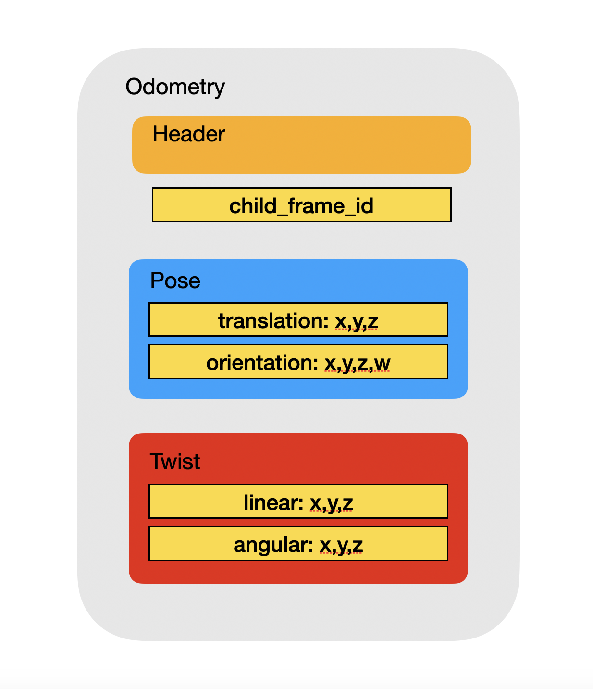
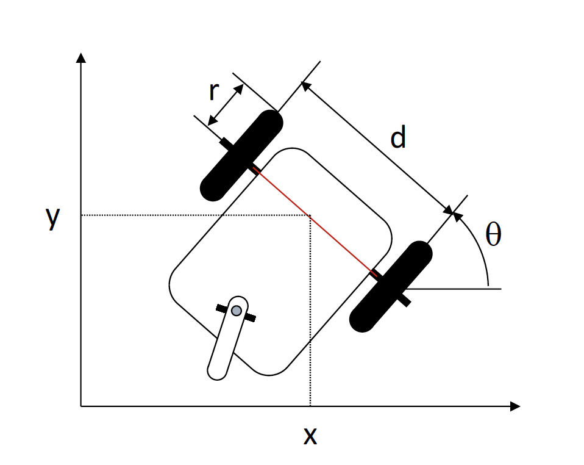

# ZEDbot robot integration
Here I am explaining the second step of the "Autonomous charging system" project concerning my master thesis in Mechatronics Engineering made in collaboration with the California State Universiy in Los Angeles. 

This subsection follows the [Simulation stage](https://github.com/LucaRoma97/ZEDbot), where I have explained the algorithm design and development, the implementation of the robot body and functionalities on Gazebo and the translation of the algorithm in C++ nodes communicating in ROS framework.

After the Simulation step, I wanted to test the algorithm on an actual robot. Actually, it was expected to test the algorithm on the robot present in the Electrical and Computer Science Department of the California State University. Unfourtanetely, the department has been closed for the entire duration of my experience in Los Angeles.
So, I decided to build one simple three-wheels robot. This robot is composed of the following main elements:

- **Jetson Nano** to run the ROS functions.
- **ZED 2 stereocamera** from Stereolabs to extract the camera data.
- **Encoders sensors** to keep track of the robot movements.
- **Arduino / motor driver** to provide the speed to the motors and to transmit the encoders data.

ZED 2 & Encoders           |  Jetson Nano              |  Arduino / motor driver
:-------------------------:|:-------------------------:|:-------------------------:
  |   |  

Here I will briefly refer on the Hardware Set Up focusing on the communication between the various elements. Then I will focus on the development of the control system and at the end I will talk about the software integration with the simulation system.  

- [Hardware Set up](https://github.com/LucaRoma97/ZEDbot-robot-integration#hardware-set-up)
- [Control system Development](https://github.com/LucaRoma97/ZEDbot-robot-integration#control-system-development)
- [Software integration](https://github.com/LucaRoma97/ZEDbot-robot-integration#software-integration)

## Hardware Set up
The core of the robot is the NVIDIA Jetson Nano embedded platform. It gets the camera data from the ZED 2 stereocamera and the encoders data as input, elaborates them and provides as output the speeds for the right and left wheels. 

Communication bridges:
- **ZED -> Jetson** : Camera Data
- **Encoders -> Arduino -> Jetson Nano** : Encoders data
- **Jetson -> Arduino -> motor driver** : Speed data transmission

You can find the bill of materials on my [Portfolio page](https://ibrahimovic19974.wixsite.com/website/autonomous-charging-project) and the video of the [building](https://www.youtube.com/watch?v=MnDWOQ7e5MM&t=22s) of the robot on my Youtube channel. 

## Control system development
In the case of a real robot, it is needed to develop a control system in order to have a feedback on the actual speed, because the motors answer in different way, they ar not clones. While in the simulation the robot will follow stricly the published speeds, with real motors all the uncertainties come out and a feedback on the wheels rotation is mandatory to keep control of the robot movements. In this case, I have developed a simple PI control system.

The developed control system compares the desired speed coming from the docking algorithm and the actual speed from the encoders, applies the proportional and integrative parameters and computes the input to be sent to the motors.

## Software integration
The three main functions added for the software integration are:

- **ROS encoders**: Arduino compatible function that publishes the encoders data and transmit the speed to the motor driver.
- **odom_function**: To subscribe the encoders data and transform them in odometry information, published on Master.
- **VelDocking**: To integrate the control system by subscribing the *dockingrobot* and *odom_function* nodes.

These three functions call each other and work simulateously. 

### ROS encoders
In this function the first step has been to initialize the pins according to the connected wires. The pins *enA* and *enB* concern the duty cycle of the PWM wave to be transmitted to the corresponding motor driver pins, while the others refer only on the direction of the rotation.

Then, two are the main functionalities this function implements:
- **encoders**: to count the "ticks" (i.e. time in which the sensor detects an hole on the disk) and publishes on *wheel_encoder* topic. It takes advantage of 3 interrupts, 2 attached to the encoders pin (left and right) and a timer interrupt to call a function each 0.1 sec to publish the amount of ticks until that moment.
- **motor input**: to subscribe the final speed input information coming from *VelDocking* (*cmd_vel*) and set it to the relative pins.

### odom_function
The goal of this function is to manipulate the encoders data (ticks) and to publish them under the odometry message structure. 

The passages are the following:
- **ticks -> Left and right velocities**: by the mean of a time reference and the radius information
- **Left and Right velocities -> Vx, Vy and Vth**: simple differential drive 
- **Vx, Vy, Vth -> x, y, th**: progressively increasing them by multiplying the velocities with the time reference
- **Pubblication** of all these data on *odom* topic.

### VelDocking
This function integrates the PI control system described above. It executes three main features:
- *Subscription* to the **desired_speeds** coming from the simulation [docking function](https://github.com/LucaRoma97/dockingrobot/tree/a28d013236bdf047667e3db3c0b97a9e773126d9).
- *Subscription* to the **wheel_encoder** topic where Arduino functions publishes the actual speeds.
- *Pubblication* of the computed input on the **cmd_vel** topic.

The two speeds are compared and the inputs are computed by applying the proportional and integrative parameters per each wheel. A range for the inputs is set in order to be compatible with the motor driver limitations (0-255). The control system parameters (i.e. Kp and Ki) have been calibrated during the robot tests. 
